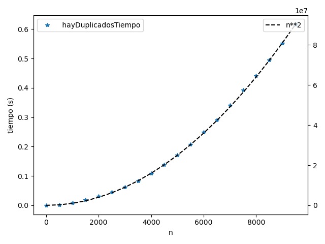

# Laboratorio 9

## Ejercicio 1

t(8001) = 0.441508s = c. 8001^2 => c = 6.9 x 10^(-9)

## Ejercicio 2

datos_ej2.csv

```
n	    hayDuplicadosTiempo
1	    1e-06
501	    0.001978
1001	0.008
1501	0.018101
2001	0.030859
2501	0.044586
3001	0.061403
3501	0.083649
4001	0.109106
4501	0.138985
5001	0.171564
5501	0.207706
6001	0.248726
6501	0.291404
7001	0.340182
7501	0.392242
8001	0.441508
8501	0.495915
9001	0.55262
9501	0.616309
```



## Ejercicio3

datos_ej3.csv
```
n	    tiempo
1	    1e-06
501	    0.00177
1001	0.00702
1501	0.015772
2001	0.028026
2501	0.044131
3001	0.063517
3501	0.08643
4001	0.113233
4501	0.142388
5001	0.175877
5501	0.211983
6001	0.251689
6501	0.297145
7001	0.344203
7501	0.394197
8001	0.450056
8501	0.505376
9001	0.566415
9501	0.63224
```


La complejidad no cambio porque no hay repetidos, sigue siendo el peor caso.

## Ejercicio 5

### v.size()


### v.push_back(e)


### v.pop_back()

